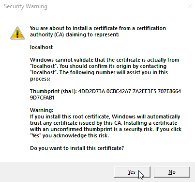

# Configuring your local system for the Emulator

> [!NOTE]
> If you're using .NET Aspire the SSL will be installed for you without configuration required. If you wish to change how that works, or tweak the behaviour slightly, the documentation will show you how.

The Azure SDK enforces `SSL` which requires a Trusted Root Certificate Authority on your local machine - this is unavoidable but easy to solve.

**This documentation is brief** but to make it easy to navigate use the table of contents below:

## Table of contents

1. [Using .NET Aspire](#using-aspire)
    1. [Automatic SSL](#automatic-ssl)
    2. [(Optional) Granular Configuration](#aspire-config)
2. [Manual With Docker](#local-docker)
    1. [Installing Manual Certificates](#installing-certificates)
3. [FAQ](#FAQ)

## Using Aspire

### Automatic SSL

The `Hosting` library will handle the SSL certificate creation and installation for you. 

On your first run of the Emulator you'll be prompted to install a `localhost` certificate, click `Yes` on the prompt. The certificate will be installed to your local user trusted authority store, not root, if you wish to remove it at any point. 

After the initial run you won't be prompted to install the certificate again.

<p align="center">
    
</p>

If you don't want to configure the container there's nothing left to read, enjoy the Emulator! 🎉

### Aspire Config

The following configuration changes how the `AzureKeyVaultEmulator.Aspire.Hosting` library behaves:

### Configuration Options

| Key                           | Type                 | Default     | Description |
|------------------------------|----------------------|-------------|-------------|
| `Persist`                    | `bool`               | `false`     | Persist the key vault data in an `emulator.db` file between sessions. |
| `LocalCertificatePath`       | `string`             | `""`        | Path to SSL certificates. If unset, defaults to user's local directory (e.g., `C:/Users/Name/keyvaultemulator/certs` on Windows). |
| `ShouldGenerateCertificates` | `bool`               | `true`      | Whether to auto-generate SSL certificates. |
| `LoadCertificatesIntoTrustStore` | `bool`          | `true`      | Attempts to install generated certs into the OS trust store. Requires admin rights. |
| `ForceCleanupOnShutdown`     | `bool`               | `false`     | Tries to delete certificates at `LocalCertificatePath` on shutdown. Unstable and not reliable. |
| `Lifetime`                   | `ContainerLifetime`  | `Session`   | Controls container behavior on shutdown:<br>• `Session`: Destroys container<br>• `Persistent`: Stops container without destroying it.<br><br>This will not remove the certificates from your host machine. |
| `UseDotnetDevCerts` | `bool` | `false` | Instructs the hosting runtime to generate and install SSL certificates via `dotnet dev-certs`. Useful if you have 3rd party dependencies which utilise/require the ASP.NET Core dev-cert. |


There are two ways to utilise this configuration, all of them are **optional** and will default to allow automatic SSL on your machine.

With `User Secrets` you can create a configuration section with the following options:

```json
{
  "KeyVaultEmulator": {
    "Persist": true,
    "LocalCertificatePath": "C:/Users/MyName/keyvaultemulator/certs",
    "LoadCertificatesIntoTrustStore": false,
    "ShouldGenerateCertificates": false,
    "Lifetime": "Persistent",
    "ForceCleanupOnShutdown": false,
    "UseDotnetDevCerts": false
  }
}
```

which then can be used like:

```cs
var keyVault = builder
    .AddAzureKeyVault("myLocalKeyVault")
    .RunAsEmulator(configSectionName: "KeyVaultEmulator");
```

> [!NOTE]
> The section name `KeyVaultEmulator` can be whatever you like.

Or you can pass in the same values directly as an `object`:

```cs
    var keyVault = builder
    .AddAzureKeyVault(AspireConstants.EmulatorServiceName)
    .RunAsEmulator(new KeyVaultEmulatorOptions
    {
        Persist = true,
        LocalCertificatePath = "C:/Users/MyName/keyvaultemulator/certs",
        LoadCertificatesIntoTrustStore = false,
        ShouldGenerateCertificates = false,
        Lifetime = ContainerLifetime.Persistent,
        ForceCleanupOnShutdown = false,
        UseDotnetDevCerts = false
    });
```

If you run into SSL Connection issues, ie `UntrustedRoot`, your configuration is incorrect or the certificates in your specified directory aren't installed on your machine.

If your configuration is the default and you're still experiencing SSL issues, 3rd party dependencies may be causing a certificate clash; set `UseDotnetDevCerts = true` and try again. [Wiremock.Net is known to cause this issue](https://github.com/james-gould/azure-keyvault-emulator/issues/293) and can be resolved with the `dev-cert` option.

## Local Docker

You do not need to use `.NET Aspire` to run the emulator, but you will have to generate the certificates yourself.

- First follow the [certificate generation instructions](CertificateUtilities/README.md) to prepare the certificates (3 minutes).
- Follow the [installing certificates](#installing-certificates) section below to insert them into your host machine's Root Trust Store.
- Place the generated files, `emulator.pfx` and `emulator.crt`, into a directory that is unlikely to be accidentally deleted. 
    - Your local user directory is recommended, on Windows this would be `C:/Users/Name/keyvaultemulator/certs`.
- Mount that directory as a `volume` to `certs/` when you start the container so the certificates can be installed into the API.
    - For Docker this would be using the `-v C:/Users/Name/keyvaultemulator/certs:certs/:ro`.

> [!NOTE]
> You can persist your data with a direct Docker connection using `-e Persist=true`. 
>
> This will create an `emulator.db` in the mount next to your certificates; shareable, re-usable, updated in real-time and loaded in at runtime.
>
> This is **opt-in** behaviour, without persistence the Emulator data will be stored internally at `/tmp/{guid}.db` and destroyed on shutdown.

### Installing Certificates

The certificates must be installed as a **Trusted Root CA** to achieve SSL:

- On Windows install `emulator.pfx`.
    - Right click -> Install and follow the wizard.
- Otherwise install `emulator.crt`.
    - `Linux`: Run `cp emulator.crt /usr/local/share/ca-certificates/emulator.crt && update-ca-certificates`
    - `MacOS`: Run `sudo security add-trusted-cert -d -r trustRoot -k /Library/Keychains/System.keychain <path to your certificates>`

## FAQ

> Is this safe?

Yes. It's no different than the `SSL` constraints of developing `ASP.NET Core` applications locally, or trying to use a non-existing domain/DNS with `HTTPS`.  The only other viable option was for a real domain to be purchased with valid SSL and requiring users to edit their `hosts` file to map `localhost` to `<perm domain>` which was out of the question.

> I'm using Linux and the SSL is still untrusted?

Please exit your IDE/terminal running your application, run `sudo update-ca-certificates` and restart the container; subsequent uses of the Emulator will now be trusted.

> My setup is the default options and SSL is Untrusted (Aspire only)

Set the option `UseDotnetDevCerts = true` and re-run your application/pipeline. 3rd party dependencies that enforce the usage of the `dotnet dev-certs` certificate are [known](https://github.com/james-gould/azure-keyvault-emulator/issues/293) to cause this issue.

> I'm using Persist but my `emulator.db` is split into 3 files. Why?

SQLite will combine the files when the container/host shuts down gracefully, but won't if the process unexpectedly terminates. To combine them into a single browsable file you need [SQLite Tools](https://www.sqlite.org/download.html) installed and to run the command: `sqlite3 <databasename>.db "VACUUM;"`

> Do I need perform all of this configuration every time I want to use the Emulator?

No. You only need to do this once, unless you uninstall and delete the certificates. If you remove them from your local machine you will need to repeat this process **once**, and then never again. Unless you remove them from your local machine... you get the idea.

> Is this required? Why can't we just use `HTTP`?

Yes, it's required, and unfortunately we can't use HTTP. The Azure Client SDK enforces `HTTPS` (and thus SSL certificates) when checking the `vaultUri`. Without the certificates installed as trusted the connections from the SDK into the Emulator will timeout and throw an exception due to `UntrustedRoot`.

> I followed the documentation and still can't get a trusted connection to work. What next?

If you're validating the requests using your browser please restart it. You will need to fully close *all* instances, not just the tab/window you're looking at. If that still doesn't help please [raise an issue](https://github.com/james-gould/azure-keyvault-emulator/issues).
